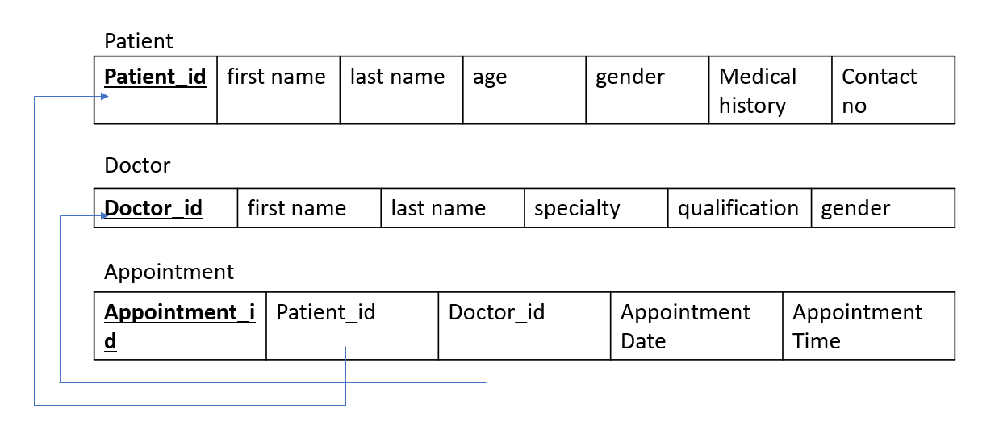
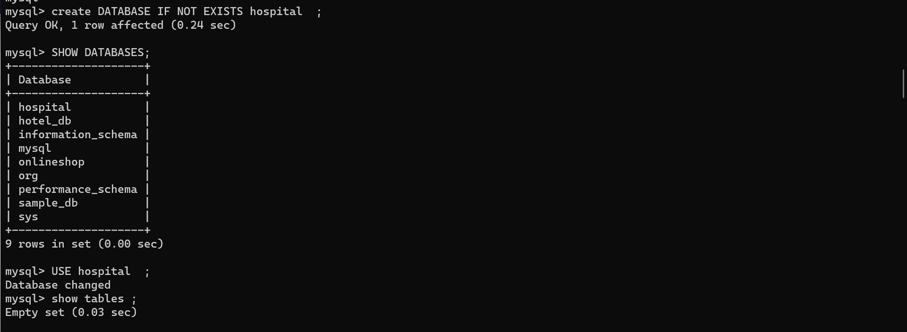
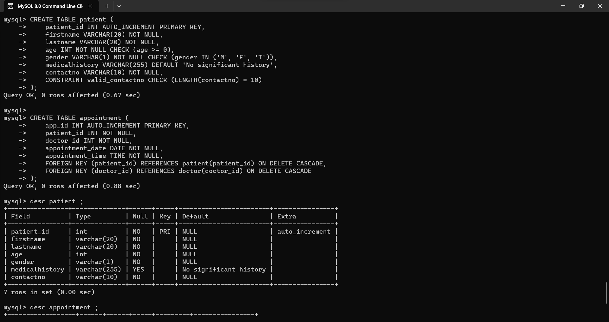
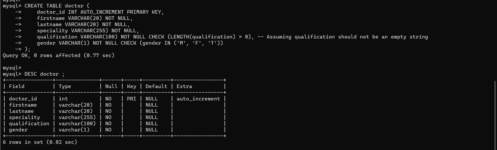
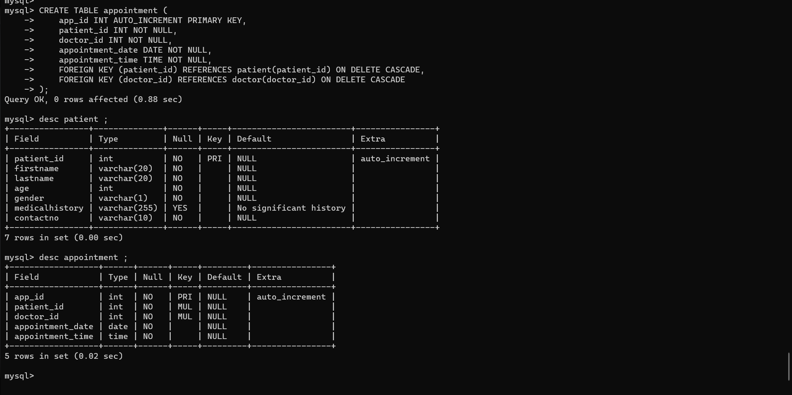
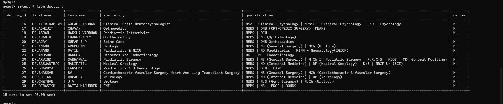

# Hospital Management System

Welcome to the Hospital Management System! This system allows users to manage appointments through a command-line interface.

## Features

1. **Add Patient**
   - Enables users to add a new patient to the system.
   - Captures patient details such as name, contact number, and other relevant information.

2. **View Patient Records**
   - Displays a list of all registered patients.
   - Provides details such as patient ID, name, contact number, and additional information.

3. **View Doctors**
   - Shows a list of available doctors in the hospital.
   - Includes details like doctor ID, name, specialization, and other relevant information.

4. **Book Appointment**
   - Allows users to schedule appointments with a specific doctor.
   - Requires patient information, doctor selection, and appointment date/time.

5. **Exit**
   - Exits the Hospital Management System.

## Database - MySQL

### Schema Diagram

### Creation of Database

### Creation of Tables

    

## Getting Started
### Prerequisites
*   Java Development Kit (JDK) installed.
*   MySQL database server installed.
*   Eclipse IDE installed.

### Setup
* Clone the repository:

        git clone https://github.com/anchals0915/Hospital-Management-System.git

*   Import the project into Eclipse.
*   Create a MySQL database named hospital.
*   Update the database using Doctor.java, Patient.java, and Appointment.java.
*   Run the application.

##  Contributing
Contributions are welcome! If you find any issues or have improvements to suggest, feel free to open an issue or submit a pull request.

##  Author
[Anchal Singh](https://www.linkedin.com/in/anchalsingh1509/)
